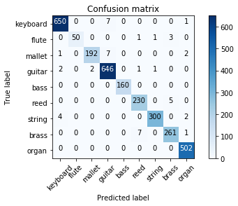

# Classification of Musical Instruments by Sound

#### Final Project for CSCI E-89 Deep Learning  Harvard University 


# Problem Statement:  

The goal is to develop the model which will allow us to recognize music instrument from the sound of it. I will use convolutional neural network, implementing it using Keras -  high-level neural networks API, running on top of TensorFlow. As dataset, I will use The NSynth Dataset, which contains sounds of solitary musical notes from various instrument families.

# Dataset Description: 

NSynth is an audio dataset containing 305,979 musical notes, each with a unique pitch, timbre, and envelope. For 1,006 instruments from commercial sample libraries, authors generated four second, monophonic 16kHz audio snippets, referred to as notes with indicating the instrument family the record came from.

•	Large size (zipped): 23.5 Gb, 305,979 record.

•	Subset that was used: 1.13 Gb, 9,460 record for training; 371 Mb, 3,039 files for testing.

https://magenta.tensorflow.org/datasets/nsynth


# Overview of Technologies Used:

Keras – high-level neural networks API, written in Python and capable of running on top of TensorFlow – was used to implement the model to solve the problem. It has very user-friendly user interface and offers consistent & simple APIs. Librosa package was used to extract features from raw sound file. 

# Results:

Let's calculate confuction matrix:


```python
plot_confusion_matrix(confusion_matrix, classes=labels,
                      title='Confusion matrix')

```

    Confusion matrix, without normalization
    [[650   0   0   7   0   0   0   0   1]
     [  0  50   0   0   0   1   1   3   0]
     [  1   0 192   7   0   0   0   0   2]
     [  2   0   2 646   0   1   1   0   0]
     [  0   0   0   0 160   0   0   0   0]
     [  0   0   0   0   0 230   0   5   0]
     [  4   0   0   0   0   0 300   0   2]
     [  0   0   0   0   0   7   0 261   1]
     [  0   0   0   0   0   0   0   0 502]]
    





Confusion matrix looks very good! Among miss-predicted values is keyboard predicted as guitar (7 times) and reed predicted as brass (5 times).

# Conclusions 

I used Convolutional Neural Network to create a model for classification music instruments by sound. As datasource, I choose very clean dataset NSynth from Magenta. It contains the record of a solitary note per file. The model, implemented thought Keras, trains very fast (~10 epochs, each takes around 1 minute, was enough) and produces very good results (98% test accuracy). 

Keras provides very user-friendly user interface and consistent & simple APIs for NN development. It’s really pleasure to work with it.  

I would like to expand the model to learn how to recognize instrument not from the single note, but from actual piece of music with a single predominant instrument. I found suitable dataset – IRMAS (https://www.upf.edu/web/mtg/irmas). But model, similar to the one I successfully used for NSynth Dataset, when trained on IRMAS dataset (with modification to accommodate more complex data), gives me only 47.5% testing accuracy (number of classes – 9). Although training accuracy was ~97%, no matter how I tried to apply regularization of such model. 

Also, it would be interesting to use other sound features, which can be extracted from sound file using Librosa library, like spectral centroid, roll-off frequency, tonal centroid features, zero-crossing rate, etc. It didn’t make sense to with NSynth (as we already have ~98% test accuracy) but it might help with more complex IRMAS dataset.  I feel like to include these features, we shouldn’t just put them as additional dimension to convolutional network. I tried to build network which takes several inputs – to feed first input (mfcc) to convolutional part of the network, then flatten it and feed to second input (vector of other abovementioned feature) to dense layer, but my network failed to converge. I’m looking forward to investigate matter further.

As I discovered, problem of recognizing musical instrument from the sound of it can be successfully and easily solved if we deal with the record of the single note, but requires more sophisticated approaches if we want to classify instruments from an actual piece of music.  


# References: 

Code and technical info:

https://keras.io/

https://anaconda.org/anaconda/anaconda-navigator

https://www.python.org/

http://jupyter.org/

https://github.com/librosa/librosa

https://blog.manash.me/building-a-dead-simple-word-recognition-engine-using-convnet-in-keras-25e72c19c12b

http://scikit-learn.org/stable/auto_examples/model_selection/plot_confusion_matrix.html#sphx-glr-auto-examples-model-selection-plot-confusion-matrix-py

http://nbviewer.jupyter.org/github/librosa/librosa/blob/master/examples/LibROSA%20demo.ipynb

Data source:

https://magenta.tensorflow.org/datasets/nsynth


